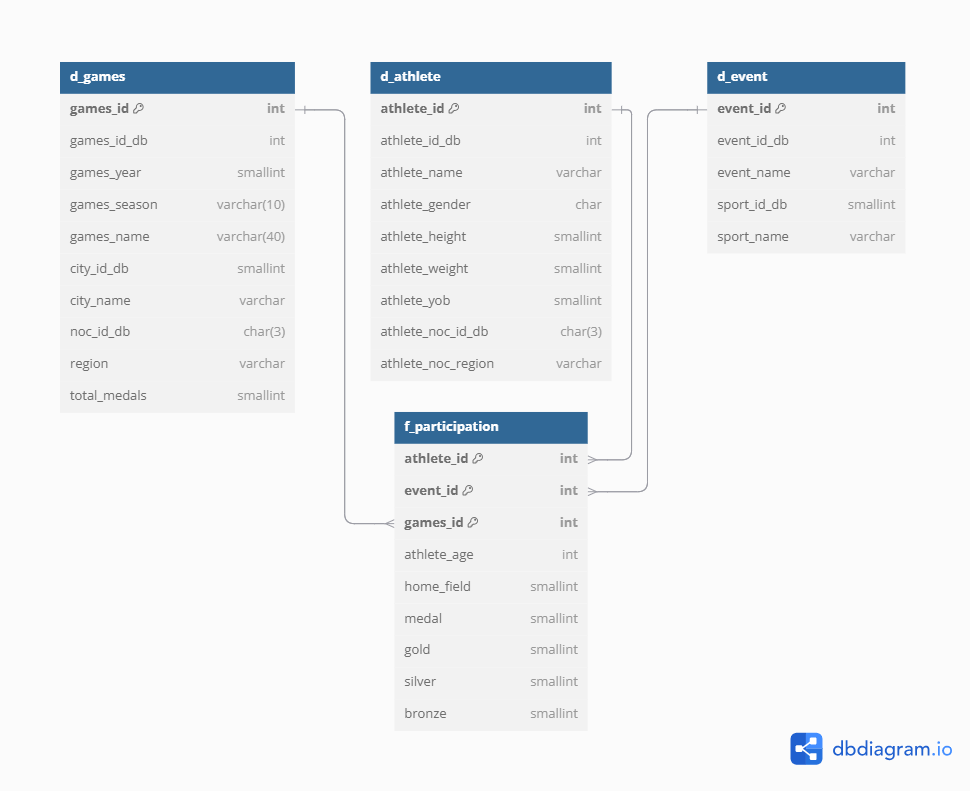

# PI-Amazon-Redshift
Amazon Redshift – skladište podataka u oblaku - projekt u sklopu kolegija Poslovna inteligencija (izvodi se na diplomskom studiju Računarstva i matematike na PMF-MO)

U .pdf datoteci može se pronaći kratak opis za ovaj projekt.

## Moj komentar na projekt i kako je sve počelo
*Zašto baš ova tema?*

Prilikom izbora teme nisam se pretjerano dvoumio i izabrao sam upravo Amazon Redshift jer mi je djelovao najintuitivnije što se tiče sintakse. Nije nužno striktno koristiti Amazonovu sintaksu u njihovom editoru, već se može pisati i kroz SQL standard kao u PostgreSQLu. Također, koncept arhitekture i mogućnosti koje nudi ova AWS usluga činio mi se izuzetno zanimljivim za istraživanje, a tema odličnom za dubinsko proučavanje i izradu kvalitetnog projektnog rada, koji je na kraju i maksimalno bodovan.

💻Kako je počela priprema za projekt?

Prvotni fokus bio je na izradi skladišta podataka. U suradnji s predavačem izrađeno je skladište podataka priloženo u .sql datoteci, gdje su podaci preuzeti iz .zip datoteke (koja sadrži pripadajuće tablice relacijske baze podataka za olimpijske igre). Vizualni prikaz skladišta može se vidjeti na slici ispod (slika je također priložena u Git repozitoriju).

📖Proučavanje AWS usluge Redshift.

Prvo sam napravio račun na AWS-u kako bih mogao pristupiti usluzi Redshift. Nakon toga krenuo sam istraživati osnove Redshifta putem interneta i YouTube platforme — kako se koristi i kako povezati podatke. Zatim sam proučavao materijale o ovoj temi na službenoj AWS stranici, uz pažljivo bilježenje važnih pojmova i načina rada s Redshiftom (od arhitekture, preko povezivanja s ostalim uslugama, do unosa podataka u Redshift kroz *Query Editor v2*).

⌚Ovaj proces (sažeto opisan u README kako ne bi ispao još jedan dodatni seminar o savladavanju usluge 😄) trajao je otprilike jedan do dva tjedna. Svi rezultati dostupni su u .pdf datoteci pod nazivom *Poslovna inteligencija – projekt - Dominik Horvat*

